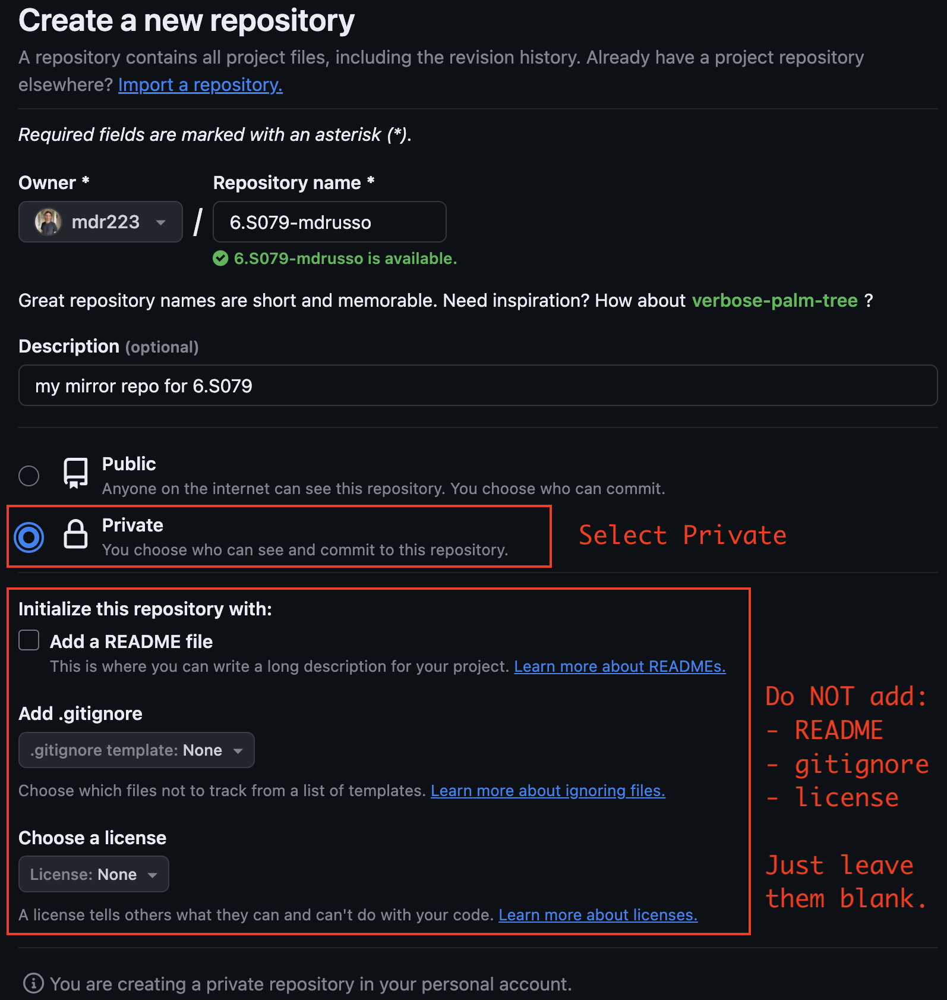
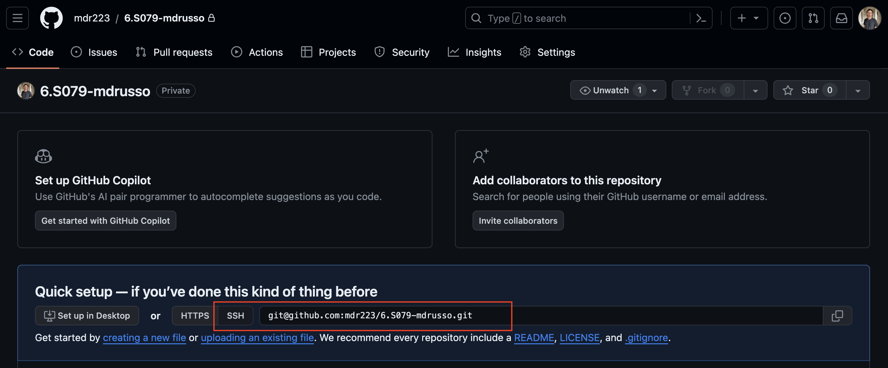

# Lab 0: Setting Up Your Environment
---
* **Learning Objective**: Learn to connect to a remote server to work on this lab.
* **Deliverables**: Ability to `ssh` into your assigned EC2 instance (i.e. machine), create a private mirror of the course repository, and run a simple program to test that your environment is working. We will be using pre-configured EC2 instances for (at least some of) the labs in this course to ensure that everyone has a consistent environment. You are not required to turn anything in for lab 0, but you will be responsible for raising any issues with the setup of your environment to the course TAs in a timely fashion.

## 1. Accessing Your EC2 Instance
**Please pay careful attention to security instructions (bolded and italicized) in this section.**

To access your environment, I will email each of you a username (e.g. `user123`) and a private key via Outlook. You will need the username and private key to `ssh` into an EC2 instance. Before taking any further action, please make sure you adhere to the following guidelines:
1. ***Do not upload your private key to Github (or any other third-party service).*** Even though you will create a private mirror of this Github repo (more details below), it is still good practice to never push your key(s) to services such as Github. ***If you do this by accident -- do not panic***, just email the course staff as soon as possible so we can delete the compromised key and issue you a new one.
2. ***Only share your private key with a project partner via MIT's Slack or MIT's Outlook service (both encrypt data in transit). Do not share your key with anyone else.***

With these guidelines in mind, please open the email titled "Accessing Your 6.S079 Environment" from `mdrusso@mit.edu`. Make note of your username, the hostname of the machine you are supposed to access (read the email), and download the attached .pem key file. It is generally good practice to store your ssh key in the `~/.ssh/` directory on your laptop:
```sh
# if ~/.ssh doesn't already exist on your laptop, you should first run `mkdir ~/.ssh`
$ mv ~/Downloads/user123.pem ~/.ssh/
$ chmod 400 ~/.ssh/user123.pem
```
The second command restricts the file's access permissions to be read-only. We strongly recommend that you create an entry in your `ssh` config to simplify your `ssh` command:
```bash
# Optional, but recommended:
# create an ssh config if you don't already have one
$ touch ~/.ssh/config

# add (or append) the following entry to ~/.ssh/config:
Host datascience
  HostName ec2-12-3-45-678.compute-1.amazonaws.com  # substitute with your EC2 hostname
  User user123                                      # substitute with your username
  IdentitiesOnly=yes
  PreferredAuthentications publickey
  PasswordAuthentication no
  StrictHostKeyChecking no
  IdentityFile ~/.ssh/user123.pem                   # substitute with path to your .pem key
```
As a final reminder: please make sure that you set the `HostName` based on the machine you were assigned to in the "Accessing Your 6.S079 Environment" email. It is important for us to evenly distribute students to machines to minimze the likelihood that any one machine is overloaded at a given time. To summarize, if the number in your username modulo 3 equals:
- 0 --> use instance: `ec2-11-1-11-11.compute-1.amazonaws.com` <TODO
- 1 --> use instance: `ec2-22-2-22-22.compute-1.amazonaws.com` <TODO
- 2 --> use instance: `ec2-33-3-33-33.compute-1.amazonaws.com` <TODO

For example, `user123` would compute `123 % 3 = 0` and set their HostName to be `ec2-11-1-11-11.compute-1.amazonaws.com`. <TODO

To `ssh` to your machine you can run the following:
```sh
# assuming you created an entry in your ~/.ssh/config:
$ ssh datascience

# OR, if you did not create an entry in ~/.ssh/config:
$ ssh -i path/to/user123.pem user123@ec2-12-3-45-678.compute-1.amazonaws.com
```

Finally, if you are working with a project partner you may choose to use just one of your usernames so that you can both work on the same copy of code. To do this, you will need to share your private key with your project partner ***by sending it to them via MIT's Slack or MIT's Outlook service***. Details for how to submit your code as a group will follow at the end of this README.

## 2. Creating Mirror of Course Repository
In this section you will create a **private** mirror of the course repository under your user account on the EC2 instance. (Do not create a public fork). The steps involved are somewhat tedious, but you will only need to do them once, and then you will be able to pull all future labs directly to your machine.

1. To begin, you'll need to go to Github and create an empty **private** repository (see reference image below):
- Do *not* add a README, gitignore, or license; this may create conflicts later
- Be sure to select the option to make the repository **private** (it is public by default)
- [Click here to create Github repo](https://github.com/new)
- Click the "Create Repository" button at the bottom of the page (not shown in image)



2. On the page for your repository, copy and store the SSH URL for your repository (see image below) you will need this in step 4.


3. We'll now create an SSH key and add it to your Github account. First, `ssh` to your EC2 instance, create a key-pair, and start the `ssh-agent`. Then, copy the public key and add it to your Github profile. See the code block below for detailed instructions. Finally, [follow Github's instructions here](https://docs.github.com/en/authentication/connecting-to-github-with-ssh/adding-a-new-ssh-key-to-your-github-account#adding-a-new-ssh-key-to-your-account) for adding the public key to your Github profile. (When adding the key, keep the default "Authentication Key").
```bash
# ssh to EC2
$ ssh datascience

# create key-pair using your github email address;
# just hit enter three times when prompted
$ ssh-keygen -t ed25519 -C "your_github_email@example.com"
# ...hit enter three times...

# start ssh-agent
$ eval "$(ssh-agent -s)"

# print the public key so you can copy it
$ cat ~/.ssh/id_ed25519.pub

# Finally, follow the instructions linked above to add this key to your Github profile.
```

4. Now we're ready to create our private mirror. On the EC2 instance, execute the following:
```bash
# --- on EC2 instance ---
# first configure git with your email and name
$ git config --global user.email "your_github_email@example.com"
$ git config --global user.name "Your Name"

# configure git to use vim editor for merge conflicts;
$ git config --global core.editor "vim"

# clone the course repository
$ git clone --bare https://github.com/mitdbg/datascienceclass.git
$ cd datascienceclass.git

# push this to the private repository you created in step 1.
# you will need to change the URL to the SSH URL you recorded in step 2.
# If you encounter permission issues, make sure you have uploaded the SSH public key created in step 2 to Github by following step 3.
$ git push --mirror git@github.com/your-github-username/your-private-repo.git

# remove the public course repository
$ cd ..
$ rm -rf datascienceclass.git

# now clone your private repository
$ git clone git@github.com/your-github-username/your-private-repo.git
$ cd your-private-repo

# checkout main branch
$ git checkout main
```
5. (Optional) you may also want to have a copy of your private repository on your local machine (i.e. laptop) for developing in an IDE (more on this [below](#tip-basic-workflow-for-developing-on-remote-server)). To do this, simply run the final three commands from step 4: 
```bash
# --- on your local machine ---
# clone your private repository
$ git clone git@github.com/your-github-username/your-private-repo.git
$ cd your-private-repo

# checkout main branch
$ git checkout main
```

At this point you should be working on your own copy of the course repository on the EC2 instance (and have a copy on your local machine if you did step 5).

## 3. Committing Changes, Pulling Updates, Resolving Conflicts, and Development Tips
In this section we'll show how to (1) make and commit changes to your repository, (2) pull new updates from the course repository into your private mirror, and (3) resolve merge conflicts with the upstream repository.

### Committing Changes
As you work on the lab you should commit your changes to your remote repository frequently. To do so, simply make changes as usual and then push them to the `origin` remote repository. Do the following steps now (we will practice resolving a merge conflict with `foobar.txt` later):
```bash
# --- on EC2 instance; from root of your repo ---
# make a simple change and push to your private repo
$ echo "hello world" > foobar.txt
$ git add foobar.txt
$ git commit -m "adding foobar.txt"
$ git push origin main
# Note: you can simply use `git push` if you have already checked out the branch you're pushing to
```
This commit should now be reflected in your private remote repository.

### Pulling Updates
If you followed the steps so far, `origin` will point to your private remote repository. In order to pull updates from the course repository you'll need to add a new remote repo which we'll call `upstream`:
```bash
# --- on EC2 instance; from root of your repo ---
# add remote repository `upstream` to track course repo
$ git remote add upstream https://github.com/mitdbg/datascienceclass.git

# fetch and merge changes from course repo;
$ git fetch upstream
# this creates a local branch called upstream/main which tracks the course repo; output should look like:
# ---
# From https://github.com/mitdbg/datascienceclass
#  * [new branch]      main       -> upstream/main
#  * [new branch]      silly-ta   -> upstream/silly-ta

# merge upstream changes into your main branch;
# this should output that your branch is already up to date
$ git merge upstream/main
```
As mentioned in the comment above, there are currently no changes to the `upstream/main` branch that you do not have. Thus, this fetch and merge will not update your local branch. **The important takeaway here is that when we release new labs, the process for pulling those changes from the upstream repository to your EC2 instance is to perform:**
```bash
$ git checkout main
$ git fetch upstream
$ git merge upstream/main
```
You would then commit any changes to your private remote repository by running:
```bash
# push new changes from course repo to your private mirror
$ git push origin main
```

### !! Resolving Merge Conflicts !!
Contrary to popular belief, your course TAs are fallible and sometimes make mistakes. In these ~~common~~ rare occurences you may need to pull an update to your `main` branch from the upstream repository which will conflict with changes you've made. In this sub-section we are going to forcibly create a merge conflict and have you resolve it. The goal here is to simulate a national crisis and have you defuse it now, this way you'll be confident in your abilities if/when things really hit the fan (they won't, maybe).

Assuming you followed the steps under [Committing Changes](#committing-changes), you should have committed a file called `foobar.txt` at the root of your private repository and pushed it to `origin main`. (If you haven't, you should do so now).

Now, let's try to fetch and merge changes in the `silly-ta` branch of our upstream repository which will conflict with your copy of `foobar.txt`. (NOTE: you should normally only fetch and merge `upstream/main`, but for the purpose of manufacturing a conflict, we will merge `upstream/silly-ta` here):
```bash
$ git checkout main
$ git fetch upstream
$ git merge upstream/silly-ta
# ---
# Auto-merging foobar.txt
# CONFLICT (add/add): Merge conflict in foobar.txt
# Automatic merge failed; fix conflicts and then commit the result.
```
If things went well, you should have created a conflict similar to the one above. You can now open `foobar.txt` in vim, make your desired changes, commit them, and push them to your private repository:
```bash
$ vim foobar.txt
# --- make edits, e.g. keep changes from silly-ta ---
$ git add foobar.txt # mark conflict as resolved
$ git commit -m "merging in silly-TA's changes"
$ git push origin main
```
Sensational, you've successfully simulated incorporating your TA's urgent bugfixes into your work. Hopefully this situation will not arise during the course, but if it does you should be (a bit more) prepared for it.

### Tip: Basic Workflow for Developing on Remote Server
The most barebones way to develop on a remote server is to use a text editor such as `vim` or `emacs` to edit files directly in the terminal. However, many programmers prefer to use an IDE such as VSCode to help them write programs. One simple way to accomplish this is to create a clone of a repository on one's local machine where they can edit files in their preferred IDE. Once changes are made, they can be committed and pushed from the local machine and then pulled down and run on the remote server. This workflow looks like the following:
```bash
# --- In terminal 1, on your local machine ---
# clone your private repository (if you haven't already)
$ git clone git@github.com/your-github-username/your-private-repo.git
$ cd your-private-repo/

# --- In terminal 1, on your local machine ---
# push changes to your private repo from local
$ touch script.py
# ... make code changes ...
$ git add script.py
$ git commit -m "made change to script.py"
$ git push

# --- In terminal 2, which has an ssh session open to the remote server ---
# pull (and run) changes that were pushed from local
$ cd your-private-repo/
$ git pull
$ python script.py
```

### Tip: (Recommended) Setup Remote Development for VSCode
The downside of the basic workflow described above is that it can be tedious to constantly push and pull changes, especially when debugging minor issues. As a result, we recommend that:
1. Students check if their preferred IDE supports remote SSH development, or
2. Students use VSCode and its remote development functionality if they don't already have a preferred IDE

The download page for VSCode and instructions for setting up remote development can be found at the following links:
- VSCode download: https://code.visualstudio.com/download
- Remote Development Setup: https://code.visualstudio.com/docs/remote/ssh

If you would like help with setting up remote development with VSCode, please come to my (Matthew Russo)'s office hours, or speak with me after class.

## 3. Setup Lab 1 Environment
In this section you will execute a setup script to prepare your python virtual environment for Lab 1. You'll then write and execute a simple python script to ensure that your environment is working.

Inside the `lab_1` directory of your repository you should see a script called `setup.sh`. Simply execute the script as follows:
```bash
# --- on the EC2 machine ---
$ cd your-private-repo/lab_1/
$ bash setup.sh # Do not use other shell tools to execute the script as python virtual environment relies on bash
```
The script may take a few minutes to complete, as it will install and setup a virtual environment to house your python dependencies. Once the script has finished you should see a virtual environment has been created in a directory called `venv`.

Finally, you can activate your virtual environment and test that everything is working as expected by executing `test_setup.py`:
```bash
# --- on the EC2 machine ---
$ source venv/bin/activate
$ python test_setup.py
# ---
#     name  age
# 0  hello   42
# 1  world   24

$ # begin working on lab 1
```
We've included a rule in the repository's `.gitignore` which should prevent your virtual environment from being included in changes that you push to your remote repository. If for any reason you see `git` suggesting that you could/should push your `venv/` folder, we would advise you not to push it. We recommend this because virtual environments are relatively large and users should be able to recreate a virtual environment from a `requirements.txt`, `pyproject.toml`, or similar file which specifies all of a project's dependencies.

---
# Lab 1: SQL and Pandas
---
* **Learning Objective**: Learn to load and manipulate data using both SQL and Pandas
* **Deliverables**: Students will write queries (1) using Pandas in Python and (2) using SQL. Solutions will be submitted through Gradescope.

This lab will use both Pandas and SQL to explore a dataset of 10k Yelp reviews. The lab is split into three "parts":
1. Part 1 provides you with an overview of how to use Pandas and SQL to perform operations such as transforming, filtering, aggregating, and joining relational data. We also provide a quick overview and pointers to resources for Common Table Expressions (CTEs), Recursive CTEs, and Window Functions. These overviews are by no means exhaustive -- and you will likely need to consult [Pandas'](https://pandas.pydata.org/docs/) and [SQLite's](https://www.sqlite.org/docs.html) documentation to complete this lab -- but we hope they give you a foundation to build on.
2. Part 2 contains the queries you need to implement.
3. Part 3 contains instructions for submitting your final solutions to Gradescope.

**Note: we assume from this point forward that you have successfully completed Lab 0. As a sanity check, your `lab_1/data/` directory should look like the following:**
```bash
user123@ip-123-45-67-890:~/6.S079-mdrusso/lab_1$ ls -lth data/
total 27M
-rw-rw-r-- 1 user123 user123 8.9M Jan 26 19:19 yelp-data.tar.gz
-rw-r--r-- 1 user123 user123  13M Jan 26 18:35 yelp_reviews_10k.db
-rw-r--r-- 1 user123 user123 537K Jan 26 18:35 businesses_10k.pq
-rw-r--r-- 1 user123 user123 4.1M Jan 26 18:35 reviews_10k.pq
-rw-r--r-- 1 user123 user123 560K Jan 26 18:35 users_10k.pq
```

Remember to `source` your Python virtualenv before you start working. If you ever see the following error message, it means that your environment is not activated:
```bash
user123@ip-123-45-67-890:~/6.S079-mdrusso/lab_1$ python
Command 'python' not found, did you mean:
  command 'python3' from deb python3
  command 'python' from deb python-is-python3

# Solution:
user123@ip-123-45-67-890:~/6.S079-mdrusso/lab_1$ source venv/bin/activate
(venv) user123@ip-123-45-67-890:~/6.S079-mdrusso/lab_1$ python
Python 3.10.12 (main, Nov 20 2023, 15:14:05) [GCC 11.4.0] on linux
Type "help", "copyright", "credits" or "license" for more information.
>>> 
```

## Part 1: Pandas and SQL Overviews

### Pandas
The Pandas python library is one of the most popular tools for working with relatively small datasets (i.e. ones that fit in the main memory of a single machine). Pandas uses the `dataframe` abstraction to manipulate tabular data. It natively supports reading data from a variety of common file formats including CSVs, fixed-width files, columnar formats, HDF5, and JSON. It also allows you to import data from common database management systems (DBMSs). A comprehensive list can be found [here](https://pandas.pydata.org/pandas-docs/stable/reference/io.html).

#### 1. Reading and Parsing Files
To start, let's load the parquet data file containing the actual Yelp reviews and examine the dimensionality (i.e. shape) of our dataset while also printing its first few rows:

```py
# remember to run `source venv/bin/activate` to activate your python environment
(venv) user123@ip-123-45-67-890:~/6.S079-mdrusso/lab_1$ python
>>> import pandas as pd
>>> reviews_df = pd.read_parquet('data/reviews_10k.pq')
>>> reviews_df.shape
(10000, 9)
>>> reviews_df.head()
                review_id                 user_id             business_id  stars  useful  funny  cool                                               text                 date
0  KU_O5udG6zpxOg-VcAEodg  mh_-eMZ6K5RLWhZyISBhwA  XQfwVwDr-v0ZS3_CbbE5Xw    3.0       0      0     0  If you decide to eat here, just be aware it is...  2018-07-07 22:09:11
1  BiTunyQ73aT9WBnpR9DZGw  OyoGAe7OKpv6SyGZT5g77Q  7ATYjTIgM3jUlt4UM3IypQ    5.0       1      0     1  I've taken a lot of spin classes over the year...  2012-01-03 15:28:18
2  saUsX_uimxRlCVr67Z4Jig  8g_iMtfSiwikVnbP2etR0A  YjUWPpI6HXG530lwP-fb2A    3.0       0      0     0  Family diner. Had the buffet. Eclectic assortm...  2014-02-05 20:30:30
3  AqPFMleE6RsU23_auESxiA  _7bHUi9Uuf5__HHc_Q8guQ  kxX2SOes4o-D3ZQBkiMRfA    5.0       1      0     1  Wow!  Yummy, different,  delicious.   Our favo...  2015-01-04 00:01:03
4  Sx8TMOWLNuJBWer-0pcmoA  bcjbaE6dDog4jkNY91ncLQ  e4Vwtrqf-wpJfwesgvdgxQ    4.0       1      0     1  Cute interior and owner (?) gave us tour of up...  2017-01-14 20:54:15
```

Note that Pandas represents all strings as object types and automatically recognizes integers and floats. 

#### 2. Transformation
Data often needs to be transformed before it can be used for analysis. Pandas makes it easy to compute new columns (and to update existing columns in-place) with support for common operators (e.g., `+`, `-`, `*`, and `/`) on data types for which the operation is defined. For example, we can compute an `upvotes` column to be the sum of the `useful`, `funny`, and `cool` columns as follows:
```py
>>> reviews_df['upvotes'] = reviews_df['useful'] + reviews_df['funny'] + reviews_df['cool']
>>> reviews_df[['upvotes', 'useful', 'funny', 'cool']]
      upvotes  useful  funny  cool
0           0       0      0     0
1           2       1      0     1
2           0       0      0     0
3           2       1      0     1
4           2       1      0     1
...       ...     ...    ...   ...
9995        0       0      0     0
9996        1       0      1     0
9997        0       0      0     0
9998        0       0      0     0
9999        0       0      0     0

[10000 rows x 4 columns]
```
Additionally, Pandas has an [`apply` function](https://pandas.pydata.org/docs/reference/api/pandas.DataFrame.apply.html) which can be used to transform data. The `apply` function takes in a [lambda](https://www.w3schools.com/python/python_lambda.asp) and an `axis` value. The former specifies the data transformation while the latter specifies which dimension to apply the transformation to, i.e. column-wise (the default, with `axis=0`) or row-wise (`axis=1`). To perform the same update as before we could have computed:
```py
>>> reviews_df['upvotes_v2'] = reviews_df.apply(lambda row: row['useful'] + row['funny'] + row['cool'], axis=1)
>>> reviews_df[['upvotes_v2', 'useful', 'funny', 'cool']]
      upvotes_v2  useful  funny  cool
0              0       0      0     0
1              2       1      0     1
2              0       0      0     0
3              2       1      0     1
4              2       1      0     1
...          ...     ...    ...   ...
9995           0       0      0     0
9996           1       0      1     0
9997           0       0      0     0
9998           0       0      0     0
9999           0       0      0     0

[10000 rows x 4 columns]
```
We can also use `apply` to perform a transformation to a column. For example, to extract the `year` from our `date` column we could execute the following:
```py
>>> reviews_df['year'] = reviews_df.date.apply(lambda date: pd.to_datetime(date).year)
>>> reviews_df[['year','date']]
      year                 date
0     2018  2018-07-07 22:09:11
1     2012  2012-01-03 15:28:18
2     2014  2014-02-05 20:30:30
3     2015  2015-01-04 00:01:03
4     2017  2017-01-14 20:54:15
...    ...                  ...
9995  2018  2018-06-26 17:41:31
9996  2018  2018-01-09 20:26:13
9997  2015  2015-04-01 21:50:28
9998  2015  2015-06-08 19:32:26
9999  2015  2015-08-06 23:16:58

[10000 rows x 2 columns]
```
Note that we used `pd.to_datetime` to convert the `date` column (which was stored as an `Object` type) into a datetime which we could extract the `year` from.

#### 3. Aggregation & Filtering
Next, we'll show how to filter and aggregate our dataset to answer some simple questions. First, let's compute the average number of stars per review. We can do this by selecting the `stars` column and compute its mean as follows:

```py
>>> reviews_df['stars'].mean()
3.8543
```

We can also aggregate over multiple columns simultaneously:

```py
>>> reviews_df[['upvotes','stars']].max()
upvotes    135.0
stars        5.0
dtype: float64
```

Now let's find the most upvoted review in each year. We'll first select the columns we want, then group rows by year, and compute the max over the groups:

```py
>>> tmp_df = reviews_df[["year", "upvotes"]]
>>> tmp_df
      year  upvotes
0     2018        0
1     2012        2
2     2014        0
3     2015        2
4     2017        2
...    ...      ...
9995  2018        0
9996  2018        1
9997  2015        0
9998  2015        0
9999  2015        0

[10000 rows x 2 columns]
>>> year_most_upvotes_df = tmp_df.groupby('year').max()
>>> year_most_upvotes_df
      upvotes
year         
2005       10
2006        6
2007       13
2008       34
2009       38
2010       51
2011      135
2012       41
2013       68
2014       35
2015       59
2016       38
2017       32
2018       27
```

We can sort data with respect to a column as follows:

```py
>>> year_most_upvotes_df.sort_values("upvotes", ascending=False)
      upvotes
year         
2011      135
2013       68
2015       59
2010       51
2012       41
2009       38
2016       38
2014       35
2008       34
2017       32
2018       27
2007       13
2005       10
2006        6
```
 Using a groupby and aggregation makes the `year` column an index since we grouped over it. You can see this by observing that `year` header is on a lower line than the `upvotes` header.

 Now let's filter our new dataframe to get the most upvoted review in a few specific years of interest.

```py
>>> year_most_upvotes_df[year_most_upvotes_df.index == 2018]
      upvotes
year         
2018       27
>>> year_most_upvotes_df[year_most_upvotes_df.index < 2010]
      upvotes
year         
2005       10
2006        6
2007       13
2008       34
2009       38
```

It's worth taking a moment to understand what's going on here. When we filter a dataframe this way, we first create a boolean mask. We then use this mask to filter the data.

```py
>>> year_most_upvotes_df.index < 2010
array([ True,  True,  True,  True,  True, False, False, False, False,
       False, False, False, False, False])
```
        
We can combine boolean masks with boolean operations (`&`, `|`). For instance we could get longest durations for 2015 or 2018:

```py
>>> year_most_upvotes_df[(year_most_upvotes_df.index == 2015) | (year_most_upvotes_df.index == 2018)]
      upvotes
year         
2015       59
2018       27
```

We can also compute multiple aggregations on each group simultaneously. Suppose we wanted to compute the maximum upvotes and the average review rating in each year.

```py
>>> df = reviews_df[['year', 'upvotes', 'stars']].groupby('year').agg({'upvotes': ['max'], 'stars': ['mean']})
>>> df
     upvotes     stars
         max      mean
year                  
2005      10  3.640000
2006       6  4.250000
2007      13  4.161290
2008      34  3.811321
2009      38  3.777027
2010      51  3.711679
2011     135  3.852941
2012      41  3.739850
2013      68  3.823028
2014      35  3.770144
2015      59  3.855980
2016      38  3.835608
2017      32  3.910295
2018      27  3.999214
```

After aggregation, the columns of the dataframe are in a different format: group by columns are now treated as indices and aggregate columns have a subcolumn for each aggregate. This makes them more difficult to manipulate. In this lab, the autograder expects you to restore the default format of dataframes, as follows:

```py
>>> df.columns = ['max_upvotes', 'mean_stars']
>>> df = df.reset_index()
>>> df
    year  max_upvotes  mean_stars
0   2005           10    3.640000
1   2006            6    4.250000
2   2007           13    4.161290
3   2008           34    3.811321
4   2009           38    3.777027
5   2010           51    3.711679
6   2011          135    3.852941
7   2012           41    3.739850
8   2013           68    3.823028
9   2014           35    3.770144
10  2015           59    3.855980
11  2016           38    3.835608
12  2017           32    3.910295
13  2018           27    3.999214
```

#### 3. Joining
        
You can start to do more interesting things when you "join" data from multiple data sources together. The file `data/users_10k.pq` contains data on the users who posted each of the 10k reviews.

In addition to doing aggregations like we did for the titles data, we can also filter on conditions. Let's say we wanted to list all 4+ star reviews for restaurants by users with at least 100 fans.

First, we can find all reviews with >= 4 stars.

```py
>>> reviews_df = pd.read_parquet("data/reviews_10k.pq")
>>> good_reviews = reviews_df[reviews_df.stars >= 4] 
>>> good_reviews[['stars']]
      stars
1       5.0
3       5.0
4       4.0
6       5.0
7       5.0
...     ...
9994    4.0
9995    5.0
9996    5.0
9997    5.0
9998    5.0

[7019 rows x 1 columns]
```

Then we need to identify which businesses are restaurants. We'll approximate this by looking for businesses with the word `restaurant` in their `categories`:
```py
>>> biz_df = pd.read_parquet('data/businesses_10k.pq')
>>> biz_df['is_restaurant'] = biz_df.categories.apply(lambda ctg: True if ctg is not None and 'restaurant' in ctg.lower() else False)
>>> restaurants = biz_df[biz_df.is_restaurant]
>>> restaurants[['is_restaurant','categories']]
      is_restaurant                                         categories
1              True  Restaurants, Food, Bubble Tea, Coffee & Tea, B...
2              True        Food, Delis, Italian, Bakeries, Restaurants
3              True                  Sushi Bars, Restaurants, Japanese
4              True                                Korean, Restaurants
5              True  Coffee & Tea, Food, Cafes, Bars, Wine Bars, Re...
...             ...                                                ...
3919           True  Barbeque, Southern, Pan Asian, Thai, Vietnames...
3925           True  Coffee & Tea, Burgers, Restaurants, Fast Food,...
3926           True  Restaurants, Korean, American (Traditional), B...
3928           True  Restaurants, Breakfast & Brunch, Sandwiches, S...
3929           True  Coffee & Tea, Hookah Bars, Nightlife, Bars, Fo...

[2210 rows x 2 columns]
```

Next, we'll need to select the users with at least 100 fans:
```py
>>> users_df = pd.read_parquet('data/users_10k.pq')
>>> influencers = users_df[users_df.fans >= 100]
>>> influencers[['fans']]
      fans
0      492
2      326
5     2388
7      134
16     227
...    ...
4020   125
5080   115
5206   124
5325   162
5463   126

[144 rows x 1 columns]
```

Now we have our filtered lists of 4+ star reviews, restaurants, and influencers that we need to combine. Pandas has a `merge` function for this purpose which we'll use to join the three dataframes. A join takes rows from one dataframe, matches them with rows in another dataframe based on a condition, and outputs a new "merged" dataframe. Here we will join the `good_reviews` and `restaurants` dataframes on their `business_id` column. We'll then merge the resulting dataframe to the `influencers` dataframe on their `user_id` column:

```py
>>> good_restaurant_reviews = pd.merge(left=good_reviews, right=restaurants[['business_id', 'name']], on='business_id')
>>> good_restaurant_reviews[['business_id', 'name', 'stars', 'text']]
                 business_id                  name  stars                                               text
0     kxX2SOes4o-D3ZQBkiMRfA                 Zaika    5.0  Wow!  Yummy, different,  delicious.   Our favo...
1     e4Vwtrqf-wpJfwesgvdgxQ                  Melt    4.0  Cute interior and owner (?) gave us tour of up...
2     LHSTtnW3YHCeUkRDGyJOyw       Fries Rebellion    5.0  Amazingly amazing wings and homemade bleu chee...
3     EQ-TZ2eeD_E0BHuvoaeG5Q             Milktooth    4.0  Locals recommended Milktooth, and it's an amaz...
4     lj-E32x9_FA7GmUrBGBEWg   Brio Italian Grille    4.0  Love going here for happy hour or dinner!  Gre...
...                      ...                   ...    ...                                                ...
4875  vLT1KtrA9bWvjFOg-0xVIg     Pieology Pizzeria    5.0  Best pizza in town. Staff is always friendly, ...
4876  0qu0fNTOsSmuREYVIMPuIQ    Cold Spring Tavern    4.0  I went here 5-7 years ago.  I remember it bein...
4877  1-z7wd860Rii4kbEMCT8DA   Moon's Kitchen Cafe    5.0  Excellent food and service. The place is funct...
4878  EpREWeEpmR8f1qLHzzF0AA  Schlafly Bottleworks    5.0  Just about to get tucked into a meatloaf that ...
4879  2XYPFRm7teCUr3eGsB2-qw           Thai Orchid    5.0  I and my husband went here for Dinner one day ...

[4880 rows x 4 columns]

>>> good_restaurant_reviews_by_influencers = good_restaurant_reviews.merge(influencers[['user_id', 'name']].rename(columns={'name': 'influencer'}), on='user_id')
>>> good_restaurant_reviews_by_influencers[['name', 'stars', 'text', 'influencer']]
                                name  stars                                               text influencer
0                   Earl of Sandwich    4.0  As airport grab-and-go restaurants are, Earl d...      Bruce
1                  Beck's Cajun Cafe    4.0  A wee bit pricey for the portions they serve. ...       Gary
2                       Ichicoro Ane    5.0  Ichicoro Ane gets lots of things right and the...     Carlos
3                  African Small Pot    4.0  This is a small hole in the wall in the Africa...       Jeff
4                  Four Green Fields    4.0  Nice little bar located at the very far end of...        Amy
..                               ...    ...                                                ...        ...
81    August Moon Chinese Restaurant    4.0  I don't eat a ton of Chinese takeout because I...       John
82              Publix Super Markets    4.0  As with all Publix locations I have been to in...      Martí
83                      Crown & Bull    4.0  Kelley's is a good solid place to eat. The bre...        Rob
84  The Blind Tiger Cafe - Ybor City    5.0  The Blind Tiger is tucked in near some antique...       Mike
85                         Marrakesh    4.0  I came to Philly for a weekend trip with my bf...  Stephanie

[86 rows x 4 columns]

```
Note that you can call `pd.merge()` and specify the `left` and `right` dataframes in the join, or you can call `left_df.merge(right_df, on=...)`; both are semantically equivalent. In the second merge we also rename the column `name` in the `influencers` dataframe to `influencer` to avoid having it conflict with the `name` column for the businesses. Pandas would still merge the dataframes without this renaming, but it would apply suffixes to the name columns (e.g., `name_x`, `name_y`) to denote which column came from the left and right dataframe, respectively. Given the ugly nature of these suffixes, it is a good practice to avoid such confusion by renaming conflicting columns when merging dataframes.

There are a lot of things you can do with Pandas that we have not covered, including different kinds of aggregation, plots, joins, input and output formats, etc. You are encouraged to use online resources to explore this for yourself when completing this lab.

### SQL

While Pandas is a great tool for exploring small datasets, there are use cases where it may not be the right tool for the task.

Pandas runs exclusively in memory. With even moderately sized datasets you may exceed available memory on a single machine. Additionally, Pandas materializes each intermediate result, so the memory consumption can easily reach several times your input data size if you are not careful. Materializing after each operation is also inefficient, even when data fits in memory. Furthermore, if you want to save results you have to manage a set of output files. This is not a problem with small datasets like the ones this lab but as your datasets grow larger and/or more complex this becomes an increasingly difficult task.

In the examples above we also had to define the physical operations to transform the data. Choosing to or add or remove columns, the order to apply filters, etc. An alternative to this approach is to use a Database Management System (DBMS) like Postgres or SQLite that supports a declarative query language. Unlike Pandas, a DBMS can usually store data that far exceeds what you can hold in memory. Users most often interact with DBMSs through a declarative query language, typically a dialect of SQL. Unlike Pandas, in SQL you define what data to retrieve instead of the physical operations to retrieve it. This allows the DMBS to automatically optimize your query. It can choose the order to apply filters, how to apply predicates, etc.

However, it's typically a little more difficult to get started with using a DBMS. For example, you first have to define a schema for your tables and then load in all the data before you can start querying it. If you are doing a one-off analysis on some small CSV you downloaded, it is probably easier to use Pandas. Furthermore, if you have some special operation that the DBMS does not natively support, a linear regression for instance, doing this inside a DBMS can be cumbersome. 

In this section we will introduce you to a simple DBMS called SQLite. Perhaps the [2nd most deployed software package](https://www.sqlite.org/mostdeployed.html) of all time! Unlike most DBMSs which run all the time and are accessed over a network. SQLite runs as a library in the same process as your program and stores all of its state in a single file. This makes it easy to deploy, use, and play around with SQL.


#### 1. Exploring the Schema

We've given you a database file `data/yelp_reviews_10k.db` into which the data in the parquet files have been loaded using Pandas' [`to_sql()` command](https://pandas.pydata.org/docs/reference/api/pandas.DataFrame.to_sql.html).

Let's begin by opening a SQLite shell and taking a look at our data. The `-column -header` settings pretty print the output into columns with a header. We can see the tables loaded into the database by running `.tables` and the schema of these tables with `.schema [tablename]`. We will then run our first SQL query to fetch the first few rows of the `users` table. Note that table names, column names, and SQL keywords are typically not case sensitive.

```sh
root@40ce47bd550e:/lab1# sqlite3 data/yelp_reviews_10k.db -column -header
SQLite version 3.31.1 2020-01-27 19:55:54
Enter ".help" for usage hints.
sqlite> .tables
businesses  reviews     users     
sqlite> .schema users
CREATE TABLE IF NOT EXISTS "users" (
"index" INTEGER,
  "user_id" TEXT,
  "name" TEXT,
  "yelping_since" TEXT,
  "useful" INTEGER,
  "funny" INTEGER,
  "cool" INTEGER,
  "elite" TEXT,
  "fans" INTEGER,
  "average_stars" REAL,
  "compliment_hot" INTEGER,
  "compliment_more" INTEGER,
  "compliment_profile" INTEGER,
  "compliment_cute" INTEGER,
  "compliment_list" INTEGER,
  "compliment_note" INTEGER,
  "compliment_plain" INTEGER,
  "compliment_cool" INTEGER,
  "compliment_funny" INTEGER,
  "compliment_writer" INTEGER,
  "compliment_photos" INTEGER,
  "num_friends" INTEGER
);
CREATE INDEX "ix_users_index"ON "users" ("index");
sqlite> SELECT * FROM users LIMIT 3;
index  user_id                 name    yelping_since        useful  funny  cool   elite                          fans  average_stars  compliment_hot  compliment_more  compliment_profile  compliment_cute  compliment_list  compliment_note  compliment_plain  compliment_cool  compliment_funny  compliment_writer  compliment_photos  num_friends
-----  ----------------------  ------  -------------------  ------  -----  -----  -----------------------------  ----  -------------  --------------  ---------------  ------------------  ---------------  ---------------  ---------------  ----------------  ---------------  ----------------  -----------------  -----------------  -----------
0      2l0O1EI1m0yWjFo2zSt71w  Shiho   2005-07-02 01:59:55  19237   9542   15235  2006,2007,2008,2009,2010,2011  492   3.92           1018            108              85                  79               40               350              742               1070             1070              403                258                5908       
1      LbPkYMGmsu4snHkY-Ri1ww  David   2011-03-05 05:28:00  10      3      2                                     2     4.71           0               0                0                   0                0                3                1                 0                0                 0                  0                  140        
2      K7thO1n-vZ9PFYiC7nTR2w  Yelper  2007-12-26 23:05:41  11276   6580   8918   2008,2011,2012,2013,2014       326   3.68           1178            182              108                 69               58               1259             2765              1900             1900              844                105                1630        
```

#### 2. Transformation
While it is possible to alter base tables to add new columns, part of the power of SQL being a declaritive query language is that it allows you to express intermediate results (e.g. `upvotes`, `year`) as part of your query without explicitly materializing those results. As mentioned above, this functionality allows the DBMS to optimize the query execution on your behalf.

#### 2. Filtering & Aggregation

Now let's get the same data as we did with Pandas and see how it looks in SQL. For simplicity, we'll use a text editor to write our queries in a text file called `scratch.sql`. We can then execute those queries by running `.read scratch.sql`. We'll show both the query and their results separated by ``+++++++++++++++++++++++`` below. Once again, we'll start by looking at the average number of `stars` per review:

```sql
SELECT
        AVG(stars)
FROM
        reviews;

+++++++++++++++++++++++
sqlite> .read scratch.sql
AVG(stars)
----------
3.8543
```

This matches the result we got from Pandas so we are on the right track. We can also aggregate columns simultaneously:
```sql
SELECT
        MAX(strftime('%Y', date)) AS max_year,
        MAX(useful + funny + cool) AS max_upvotes,
        MAX(stars) AS max_stars
FROM
        reviews;

+++++++++++++++++++++++

sqlite> .read scratch.sql
max_year  max_upvotes  max_stars
--------  -----------  ---------
2018      135          5.0
```

Now, similar to before, above we'll group by review year again:

```sql
SELECT 
        strftime('%Y', date) AS year,
        MAX(useful + funny + cool) AS max_upvotes
FROM 
        reviews
GROUP BY 
        year;

+++++++++++++++++++++++

sqlite> .read scratch.sql
year  max_upvotes
----  -----------
2005  10         
2006  6          
2007  13         
2008  34         
2009  38         
2010  51         
2011  135        
2012  41         
2013  68         
2014  35         
2015  59         
2016  38         
2017  32         
2018  27 
```

We can also order these results by `max_upvotes` in descending order. We can also limit the output to just the first few rows by using `LIMIT`:

```sql
SELECT 
        strftime('%Y', date) AS year,
        MAX(useful + funny + cool) AS max_upvotes
FROM 
        reviews
GROUP BY 
        year
ORDER BY
        max_upvotes DESC
LIMIT 5;

+++++++++++++++++++++++

sqlite> .read scratch.sql
year  max_upvotes
----  -----------
2011  135        
2013  68         
2015  59         
2010  51         
2012  41   
```
        
Finally, another important piece of functionality (which we did not demonstrate with Pandas) is use of the `DISTINCT` keyword. This is often useful when we want to count the distinct number of elements in a given column. For example, we could count the distinct number of names in our `users` table:
```sql
SELECT 
        COUNT(DISTINCT name)
FROM 
        users;

++++++++++++++++++++++++++++

sqlite> .read scratch.sql
COUNT(DISTINCT name)
--------------------
2947
```

Note that in Pandas we can also get the distinct number of elements in a column by computing `len(df[col].unique())`.

#### 3. Joining
To join two or more tables, we first list them in the `FROM` clause. We specify how to join in the `WHERE` clause. The `WHERE` clause may further contain additional filters for each individual tables.

Here is how to compute in SQL the same join we computed using Pandas:

```sql
SELECT 
        b.name AS 'business', r.stars, u.name AS 'influencer'
FROM 
        reviews AS r, businesses AS b, users as u
WHERE
        r.business_id = b.business_id -- Join condition 
        AND r.user_id = u.user_id     -- Join condition
        AND r.stars >= 4
        AND b.categories LIKE '%restaurant%' -- LIKE is case-insensitive by default
        AND u.fans >= 100
ORDER BY
        r.stars DESC,
        b.name ASC
LIMIT 10;

+++++++++++++++++++++++

sqlite> .read scratch.sql
business                                          stars  influencer
------------------------------------------------  -----  ----------
Aroy Thai                                         5.0    Kelly     
Carrollton Market                                 5.0    Helene    
Cheddar's Scratch Kitchen                         5.0    Patt      
Daves Dogs - Cart                                 5.0    Ali       
Edley's Bar-B-Que - 12 South                      5.0    Katy      
Enjoi Sweets & Company                            5.0    Allison   
Home Wine Kitchen                                 5.0    Julia     
Ichicoro Ane                                      5.0    Carlos    
In-N-Out Burger                                   5.0    Dee       
J Gilbert's Wood-Fired Steaks & Seafood St Louis  5.0    Katie 
```    

We now discuss a few useful SQL-only features.


#### 4. Common Table Expressions
Common Table Expressions (CTEs) are a useful mechanism to simplify complex queries. They allow us to precompute temporary tables that can be used in other parts of the queries. While the join above is not complex enough to warrent using CTEs, we will use it as an example to get you started. Suppose that, as in our Pandas example, we wanted to first compute the set of 4+ star reviews, restaurants, and influencers before joining them:

```sql
WITH 
good_reviews AS ( -- Precompute 4+ star reviews
        SELECT review_id, business_id, user_id, stars, text
        FROM reviews
        WHERE stars >= 4
),
restaurants AS ( -- Precompute restaurants
        SELECT business_id, name AS 'business'
        FROM businesses
        WHERE categories LIKE '%restaurant%'
),
influencers AS ( -- Precompute influencers
        SELECT user_id, name AS 'influencer'
        FROM users
        WHERE fans >= 100
)

SELECT business, stars, influencer  -- Join them.
FROM good_reviews AS gr, restaurants AS r, influencers as i
WHERE gr.business_id = r.business_id AND gr.user_id = i.user_id
ORDER BY stars DESC, business ASC
LIMIT 10;

+++++++++++++++++++++++++++

business                                          stars  influencer
------------------------------------------------  -----  ----------
Aroy Thai                                         5.0    Kelly     
Carrollton Market                                 5.0    Helene    
Cheddar's Scratch Kitchen                         5.0    Patt      
Daves Dogs - Cart                                 5.0    Ali       
Edley's Bar-B-Que - 12 South                      5.0    Katy      
Enjoi Sweets & Company                            5.0    Allison   
Home Wine Kitchen                                 5.0    Julia     
Ichicoro Ane                                      5.0    Carlos    
In-N-Out Burger                                   5.0    Dee       
J Gilbert's Wood-Fired Steaks & Seafood St Louis  5.0    Katie
```

In this query, we first compute the tables of good reviews, restaurants, and influencers using the construct `WITH table_name AS (query)`. We then perform the join using these temporary tables. 

#### 5. Recursive CTEs.
In addition to regular CTEs, you will need recursive CTEs to answer some of the questions in this lab. SQLite has an [excellent tutorial](https://www.sqlite.org/lang_with.html) about them. You should read up to and including section 3.2 of the tutoral. The topic is too complex to provide a full overview here, but feel free to ask us questions during office hours.

#### 6. Window Functions
Whereas groupby aggregations let us aggregate partitions of the data, window functions allow us to perform computations on each partition without aggregating the data.

For example, suppose that for every given year, we wanted to assign a rank to the set of good influencer reviews according to their stars. While groupbys allow to partition by year, they can only compute aggregate data for each year; they cannot assign individual ranks to each row within a partition. We need window functions for this task.


```sql
WITH 
good_restaurants (business, stars, year) AS (
        SELECT 
                b.name AS 'business', r.stars, CAST(strftime('%Y', r.date) AS INTEGER) AS year
        FROM 
                reviews as r, businesses AS b, users AS u
        WHERE
                r.business_id = b.business_id AND r.user_id = u.user_id -- Join condition 
                AND r.stars >= 4
                AND b.categories LIKE '%restaurant%'
                AND u.fans >= 100
)
SELECT
        business, stars, year,
        RANK() OVER (PARTITION BY year ORDER BY stars DESC, business ASC) AS year_rank
FROM good_restaurants
ORDER BY year;

++++++++++++++++++++++++++

business                                          stars  year  year_rank
------------------------------------------------  -----  ----  ---------
In-N-Out Burger                                   5.0    2005  1        
Cafe Buenos Aires                                 4.0    2005  2        
Termini Bros Bakery                               5.0    2006  1        
St. Louis Union Station Marriott                  4.0    2007  1        
Les Bons Temps                                    4.0    2008  1        
Rittenhouse Grill                                 4.0    2008  2        
Aroy Thai                                         5.0    2009  1        
Village Whiskey                                   5.0    2009  2        
Ghini's French Caffe                              4.0    2010  1        
Home Wine Kitchen                                 5.0    2011  1        
R2L                                               5.0    2011  2        
Izakaya Ren                                       4.0    2011  3        
Meadows Diner                                     4.0    2011  4        
Nick's Old Original Roast Beef                    4.0    2011  5        
Steamboat Natchez                                 4.0    2011  6        
Sassafras Restaurant                              5.0    2012  1        
Shephard's Beach Resort                           5.0    2012  2        
Tasty Tomato Italian Eatery                       5.0    2012  3        
Burger Up                                         4.0    2012  4        
Desire Oyster Bar                                 4.0    2012  5        
El Rey                                            4.0    2012  6
...
```

In this query we first compute the table of 4+ star influencer reviews as a CTE to simplify the query. We then select the rows of this table in addition to a yearly ranking computed as follow:

* First partition rows by year (`PARTITION BY year`).
* Order the items within each partition (`ORDER BY stars DESC, business ASC`).
* Assign a rank to each element in accordance with their order (`RANK()`).

As you can see from the results, the `year_rank` column is order within each year, and resets across different years.

This captures the general idea behind window functions: compute a result in accordance with a certain partitioning of the data. Many more things can be done with this idea. A good tutorial can be found [here](https://mode.com/sql-tutorial/sql-window-functions/)

### Pandas + SQL

One interesting feature of Pandas allows you to run a query in a database and return the result as a dataframe, so you can get the best of both worlds!

Here is a simple Python program that opens the SQLite database, reads the query from the `scratch.sql` file, executes the query and loads the result into a dataframe. This example requires that `scratch.sql` only contain a single SQL statement / query, so you will need to comment out all but one query from the `scratch.sql` file before execution:
```bash
# you can use this to write the first query in scratch.sql into test.sql
$ cat scratch.sql | head -n 5 > test.sql
```
Now we can execute the query in `test.sql` and return it as a Pandas dataframe:
```py
import pandas as pd
import sqlite3 as sql

with sql.connect("data/yelp_reviews_10k.db") as conn, open("test.sql") as in_query:
    df = pd.read_sql_query(in_query.read(), conn)
    print(df)

# ---
#    AVG(stars)
# 0      3.8543
```

## Part 2: Questions

You are allowed to work in pairs for this assignment. In addition, you can lookup general SQL or Pandas functionalities on the internet, but not specific solutions to our questions.

For the rest of the lab we will ask you to answer a few questions by (1) querying the data using Pandas and (2) querying the data using SQL. For (1), you will edit `queries.py` and implement each function (e.g. `Q1Pandas`) such that it returns a dataframe containing the answer to the question. For (2), write SQL queries in the `sql_queries` directory (e.g., write the query for Q1 in `sql_queries/q1.sql`). You should not need to make other edits to the repository or database.

For convenience, you can run queries one at a time using the `queries.py` script (the script will execute your Pandas and SQL implementations, when applicable). The syntax for executing the script is as follows:

```bash
$ python3 queries.py -q [query_num] [-s]
```

The `-s` flag is not necessary for development, but it will store your Pandas outputs in the `submission/`folder when you're ready to submit (more details below). In addition to your code, you will submit the results of running your code for each of the questions in a PDF. Put each answer on a new page. Detailed submission instructions can be found below.


### Output Format
For each question, we will specify both the order of the output columns and the order of the output rows. These must be strictly respected for the autograder to work. For Pandas, you must use `dataframe.reset_index()` before outputting the dataframe as we showed in the tutorial. It does not matter how you name the columns as long as they are in the correct order.

### Questions
#### SQL and Pandas
For each of these questions, you get half the points for getting each implementation correctly. For full credit, both Pandas and SQL implementations should be correct. **Be sure to order the columns in your results identically to how we specify the *return* order in each question**. If this is ambigious for any question, please make a post on Piazza. For example, in Q2 the columns in your result dataframe / SQL output should be ordered left-to-right as: `review_id`, `name`, `avg_rating`. (Recall that the `ORDER BY` clause determines the order in which rows in the result set are returned from top (i.e. first) to bottom (i.e. last); it does not have anything to do with the column order).

1. (Simple aggregation and ordering, 5 pts) Using the `businesses` table, compute the number of distinct business `name`s by `state`. Return the `state` and the count for each state (call this column `count`). Order by `state` (ascending).
2. (Simple filtering and join, 5 pts) Find all 5-star reviews of bars (`businesses.categories` contains `bar`) in Tennessee (state abbreviation `TN`). Return `review_id`, `name`, and `avg_rating`. Order by `avg_rating` (descending) and then `name` (ascending) to break ties. When ordering by `name`, be sure to ignore upper vs. lower case (i.e. 'Z' should not come before 'a'). (**HINT:** look at how to use `COLLATE NOCASE` when ordering in SQLite.)
3. (Simple aggregation and join, 10 pts) Find the user with the greatest number of reviews where the `stars` value differs from the user's `average_stars` by more than 2.0. If multiple users are tied, return the one with the alphabetically smallest `name`. Return the `user_id`, `name`, and number of reviews that differ by more than 2.0 stars (call this column `num_diff`).
4. (Simple subquery/CTE, 10 pts) Find the user(s) with the greatest number of reviews where the `stars` value differs from the user's `average_stars` by more than 2.0. Unlike in question (3), you should return all users who tie for most reviews meeting this criteria. Again, return the `user_id`, `name`, and number of reviews that differ by more than 2.0 stars (call this column `num_diff`). Order by `name` (ascending). DO NOT use your knowledge of the answer from question (3) when writing your query for this question. (**HINT** make use of a subquery/CTE to pre-compute a value and/or result-set of interest).
5. (Subqueries/CTEs, 10 pts) Find the Italian restaurants (`businesses.categories` contains `italian`) with the largest number of reviews in each state. The result set may contain one or many restaurants per state. Return the `state`, the business `name`, and the number of reviews (call this column `num_reviews`). Order the results by `state` (ascending) and then `name` (ascending).
6. (Subqueries/CTEs, 15 pts) Find the restaurant(s) (`businesses.categories` contains `restaurant`) with >= 10 reviews that has/have the highest average `stars` (as computed from their reviews; do NOT use `business.avg_rating` for this). Return the `name`, the number of reviews (name this column `num_reviews`), and the average stars (name this column `avg_stars`). Order the results by `name` (ascending).

#### SQL Only
7. (SQL Only: Simple window function, 5 pts) Rank the coffee shops (`businesses.categories` contains `coffee`) in each state with an `avg_rating >= 4.5`. Coffee shops in each state should receive separate rankings. Order by `state` (ascending), then `avg_rating` (descending), then `name` (ascending) to break ties. When ordering by `name`, be sure to ignore upper vs. lower case (see hint for Q2.). Return the `state`, `name`, `avg_rating`, and `state_rank` (this should be the name of your rank column).
8. (SQL Only: Window Functions, 10 pts) For each `year` (see [this section](#6-window-functions) above for how to compute `year`), find the top-3 businesses that received the most reviews. If multiple businesses are tied in the top, return all of them. Return the `year`, the `business_id`, the `name`, number of reviews (call this column `num_reviews`), and the ranking (call this column `year_rank`). Sort by `year` (ascending), `year_rank` (ascending) and `name` (ascending) to break ties.
9. (SQL Only: Recursive CTEs, TODO 10/20 pts) Find the ***category*** of business with the highest average `avg_rating`. Note that the example `categories` text `Food, Delis, Italian` should be split into a `Food` category, a `Delis` category, and an `Italian` category. You may reuse the recursive CTE csv parser found [here](https://stackoverflow.com/a/65846460) or [here](https://stackoverflow.com/a/54897341). (Note that the linked answers are not the top/accepted answers on their respective posts, but they most closely resemble what you may use to solve this problem). Return the `category` and the average `avg_rating` (call this column `avg_avg_rating`). Sort by `category` (ascending) to break ties. Be sure to filter out the null category (`length(category) > 0`).
* HINTS:
* In your recursive query, use `length(str) > 0` or `str != ''` in the `WHERE` clause of your recursive-select (simply using `WHERE str`, as shown in the second S/O example will not work for our dataset)
* Be sure to `trim()` your `category` to remove excess whitespace; futhermore, be careful that you also use `trim()` in the GROUP BY clause (if applicable) if you expect `"Foo "` and `"Foo"` to map to the same group! 
---
10. (SQL Only: Recursive CTEs, 10 pts) Degrees of separation. Recursively compute the set of actors that contains:
* Samuel L. Jackson (person_id='nm0000168')
* Actors who played in a movie with Samuel L. Jackson in 2021, played with someone who played with him in a movie in 2021, and so on.
Return the person_id, and the name ordered by name. This query should take no longer than 5 minutes to run (ours takes 2.5 minutes). Make sure you understand the difference between `UNION` and `UNION ALL` in recursive CTEs.

## Part 3: Submission Instructions
Make sure you are registered on Gradescope for this class. The course ID is `TODO`.

### Submitting as an Individual
To submit responses as an individual, simply run:
```sh
# Generate response for each query in the submission/ folder.
# NOTE: running queries.py without -q runs all queries.
python queries.py -s

# Zip the contents of the submission folder
cd submission
zip submission.zip *.csv
```

Submit the generated `submission.zip` file to Gradescope.

### Submitting as a Group
To submit responses as a group, simply run:
```sh
# Generate response for each query in the submission/ folder.
# NOTE: running queries.py without -q runs all queries.
python queries.py -s

# Zip the contents of the submission folder;
# INCLUDE YOUR MIT KERB IDs IN THE FILENAME
cd submission
zip submission_{mit_kerb1}_{mit_kerb2}.zip *.csv
```

Have one member of the group submit the generated `submission_{mit_kerb1}_{mit_kerb2}.zip` file to Gradescope. **The member who submits the assignment must then add their partner as a group member on the Gradescope submission: [details](https://help.gradescope.com/article/m5qz2xsnjy-student-add-group-members).**
