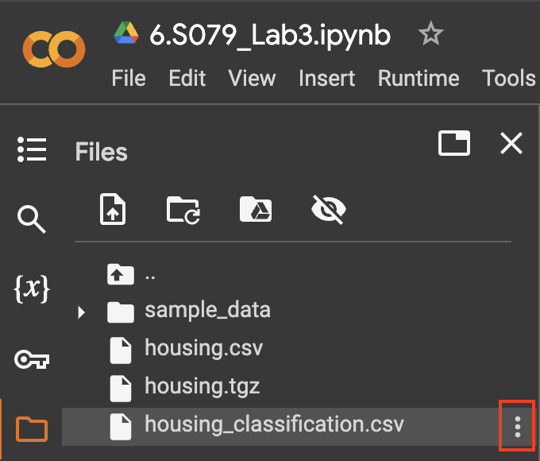

Table of Contents
=================
- [Lab 3: Machine Learning with Python](#machine-learning-with-python)
  * [1. Colab Setup](#1-colab-setup)
  * [2. Lab Overview](#2-lab-overview)
  * [3. Submission Instructions](#3-submission-instructions)
    * [Submitting as an Individual](#submitting-as-an-individual)
    * [Submitting as a Group](#submitting-as-a-group)

---
# Lab 3: Machine Learning With Python
---
* **Assigned: Tuesday, March 5th.**
* **Due: Wednesday, Marth 13th 11:59:00 PM ET.**


## 1. Colab Setup
For this lab, we will be using [Google Colab](https://colab.google/), which is a free hosted Jupyter Notebook service.

Please read the brief instructions in the first cell of the Lab 3 notebook (linked below). **You will need to create a copy of our notebook in your personal Google account.** You can then work on the copy. (Note that MIT offers a free Google workspace account with your MIT email).

The Colab notebook [for Lab 3 can be found here](https://colab.research.google.com/drive/11DuvUNfECCoTzU7BDlN1R-_J3FhFantG#scrollTo=fG9jiyOITqdU).

[*Back to top*](#table-of-contents)

## 2. Lab Overview
The aim of this lab is to implement a complete ML project in python. We will go through the steps of data exploration, cleaning and transformation, and finally model training and selection.

The lab consists of two parts. The first part is an in-class interactive tutorial adapted from [Aurélien Géron's excellent ML book](https://github.com/ageron/handson-ml2) with some modifications to make it a classification tutorial instead of a regression one. We will learn to classify neighborhoods by median house value. The tutorial will contain conceptual questions as well as fill-in code that we'll give you a few minutes to write.

In the second part of this lab, we expect you to pick a dataset of your choosing and go through the steps mentioned above. You should try at least 3 different classes of models, and one of them should be an `xgboost` classifier or regressor. We recommend that you pick a dataset from [Kaggle](https://www.kaggle.com/) or you may wish to use one of the datasets from the [suggested class projects](https://docs.google.com/document/d/1SeMe16GsJZ4hODnZMq0XIOmoaKqcZGEqZt6vUkDbVCw/edit#heading=h.3yq3z6uw5bnz). We will be very flexible in grading this lab; we just need to see that you've taken the right steps. You should submit your notebook to gradescope. Submission instructions will be given on Piazza.

[*Back to top*](#table-of-contents)

## 3. Submission Instructions
When you've finished your ML adventure and are ready to submit, you will first need to download your .ipynb file. To do this, go to `File > Download > Download .ipynb`. See the reference image below:


Once you've done that, you will also want to download any data files that you may have copied into your Colab folder. If you manually uploaded your data file(s) to Colab, then you should have a local copy already. If you used `wget`, `curl`, or `urllib.requests` to fetch the file, then you may need to manually download the file. To do this, open the Colab folder, click on the three vertical dots next to the filename (see reference image below), and click `Download`:



You will then create a `submission.zip` (see instructions below).

### Submitting as an Individual
To submit as an individual, simply run:
```sh
# copy your .ipynb and any data files into a directory named submission
mkdir submission
cp path/to/your.ipynb submission
cp your-data-file.csv submission
...

# Zip the contents of the submission folder
cd submission
zip submission.zip *.csv
```

Submit the generated `submission.zip` file to Gradescope.

### Submitting as a Group
To submit responses as a group, simply run:
```sh
# copy your .ipynb and any data files into a directory named submission
mkdir submission
cp path/to/your.ipynb submission
cp your-data-file.csv submission
...

# Zip the contents of the submission folder
cd submission
zip submission.zip *.csv
```

Have one member of the group submit the generated `submission.zip` file to Gradescope. **The member who submits the assignment must then add their partner as a group member on the Gradescope submission: [details](https://help.gradescope.com/article/m5qz2xsnjy-student-add-group-members).**
