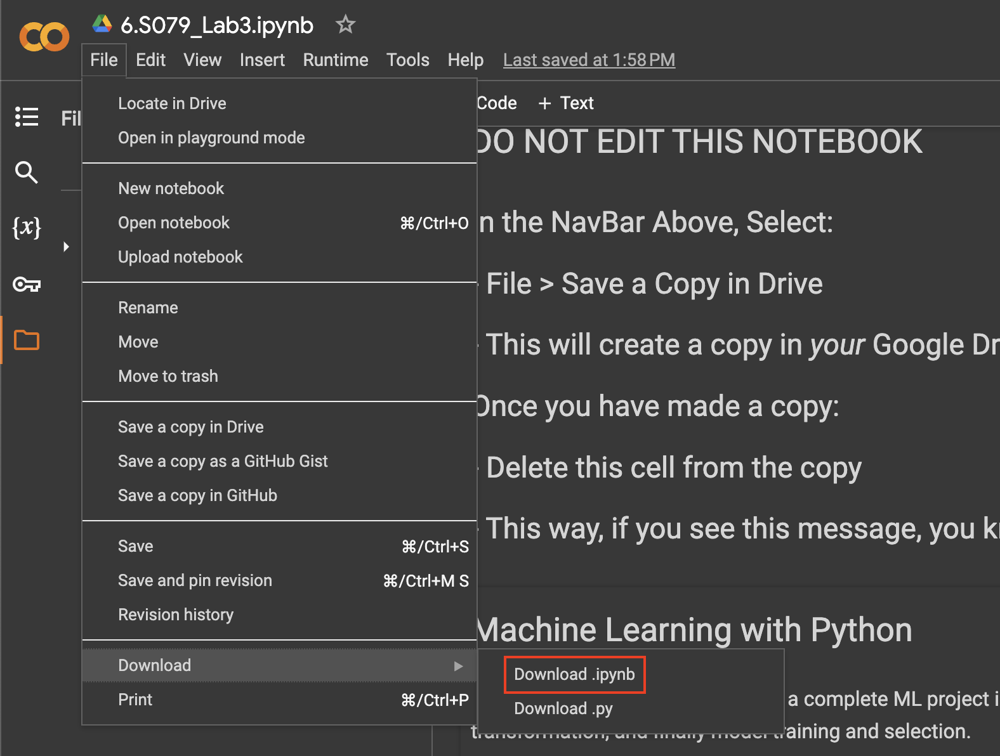

Table of Contents
=================
- [Lab 5: A Crimson 2084 (The LLM Apocalypse)](#lab-5-a-crimson-2084-the-llm-apocalypse)
  * [1. Colab Setup](#1-colab-setup)
  * [2. Lab Overview](#2-lab-overview)
  * [3. Submission Instructions](#3-submission-instructions)
    * [Submitting as an Individual](#submitting-as-an-individual)
    * [Submitting as a Group](#submitting-as-a-group)

---
# Lab 5: A Crimson 2084 (The LLM Apocalypse)
---
* **Assigned: March 27th.**
* **Due: April 10th, 11:59:59 PM ET.**

* **Learning Objective**:
- Basic prompt engineering / hacking
- How to fine-tune a 7B parameter open-source LLM
- How to incorporate human feedback using DPO (an RLHF technique without the RL)
- How to make use of the token log-probabilities for visualizing/contextualizing LLM outputs
* **Deliverables**: You will ruin Dr. McCrimsonHuggingFace's life's work.

## 1. Colab Setup

For this lab, we will be using Google Colab, which is a free hosted Jupyter Notebook service.

Please carefully read the instructions in the first few cells of the Lab 5 notebook (linked below). You will need to create a copy of our notebook in your personal Google account. You can then work on the copy. (Note that MIT offers a free Google workspace account with your MIT email).

The Colab notebook for Lab 5 can be found [here](https://colab.research.google.com/drive/1lhOkrJFV_oxEKiUW1lWxExwrEeR2BNmG).

[*Back to top*](#table-of-contents)

## 2. Lab Overview
In this lab, you will get hands-on experience working with a 7B-parameter open-source LLM. All the tasks and questions are described in `6.S079_Lab5.ipynb`. Your job is to fill out the notebook.

### Running Updates
This section is a rough copy of the running updates post on Piazza. We will do our best to keep the Lab README as up-to-date as possible with the Piazza post.

## 3. Submission Instructions
First, please make sure that your Colab Notebook settings allow anyone with the link to see and edit it.

Next, **make sure that the outputs of all of your cell executions are visible.** The TAs will be grading this lab the old-fashioned way (by reading your code and its outputs). Furthermore, since we are not you, we cannot re-run any of your cells which rely on files stored in your personal Google Drive after you've submitted. Thus, if we don't see the output of a cell, we're going to have to send you persistent emails asking you to execute the cells on our behalf.

Once you've finished -- and you've run all of the necessary cells to display your outputs -- download your `.ipynb` file. To do this, go to `File > Download > Download .ipynb`. See the reference image below:

### Submitting as an Individual

Submit the filled and executed `6.S079_Lab5.ipynb` file to Gradescope.

### Submitting as a Group
Have one member of the group submit the `6.S079_Lab5.ipynb` file to Gradescope. **The member who submits the assignment must then add their partner as a group member on the Gradescope submission: [details](https://help.gradescope.com/article/m5qz2xsnjy-student-add-group-members).**
