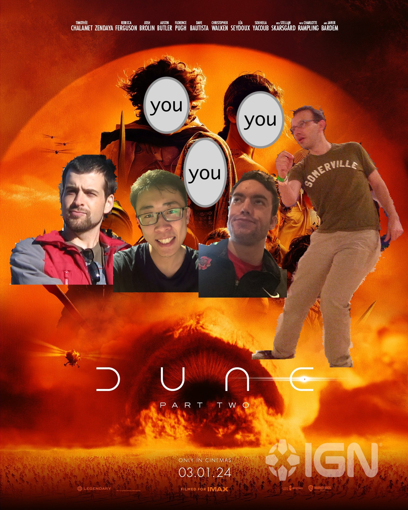

Table of Contents
=================
- [Lab 6: Ray Dune (The Battle for Arrakis)](#lab-6-ray-dune-the-battle-for-arrakis)
  * [1. Accessing Your EC2 Instance](#1-accessing-your-ec2-instance)
  * [2. Additional Setup](#2-additional-setup)
  * [3. Setup Lab 6 Environment](#3-setup-lab-6-environment)
  * [4. The Battle for Arrakis](#4-the-battle-for-arrakis)
    * [Spark (30 pts)](#spark-30-pts)
    * [Ray (70 pts)](#ray-70-pts)
    * [How to Run the Game](#how-to-run-the-game)
    * [Game Overview](#game-overview)
    * [Ray Crash Course](#ray-crash-course)
    * [Recommended Strategy](#recommended-strategy)
    * [Ray Resources](#ray-resources)
  * [5. Submission Instructions](#5-submission-instructions)
    * [Before You Submit: Push Your Changes](#before-you-submit-push-your-changes)
    * [Submitting as an Individual](#submitting-as-an-individual)
    * [Submitting as a Group](#submitting-as-a-group)

---
# Lab 6: Ray Dune (The Battle for Arrakis)
---
* **Assigned: April 11th**
* **Due: April 23rd, 11:59:00 PM ET.**

#### Foreword
The goal of this lab is to teach you a bit about:
1. large-scale parallel execution (Spark and Ray)
2. distributed asynchronous programming (Ray), and
3. to familiarize you with (parts of) Ray, which is a popular Python framework for distributed parallel computation, model training, model serving, and more

We will not be covering what Ray is probably most popular for, which is its model training and dataset pre-processing libraries (notably, it has been reported that OpenAI uses Ray for training its models).

We won't be covering these because:
1. Setting up the infrastructure, sharing it amongst you, and debugging issues would be even more difficult than Lab 5
2. There are a multitude of tutorials on the internet which can help you get started w/model training and dataset pre-processing in Ray
3. And most importantly, **if you understand the lower-level concepts of distributed asynchronous programming (i.e. Ray Core) then using the Ray libraries (Ray Train, Ray Data, etc.) will be easy by comparison**

With that out of the way, let's begin!



---
---
---
> *\"The person who controls ~~the spice~~ Ray controls the universe. A process cannot be understood by stopping it. Understanding must move with the flow of the process, must join it and flow with it.
> \-- Dune\" \-- Your TAs Trying to Teach you Ray (and Spark)*
---
---
---
You awaken on the planet [Arrakis](https://dune.fandom.com/wiki/Arrakis) -- the home of the [Fremen](https://dune.fandom.com/wiki/Fremen) people -- amidst a terrible war started between members of [The Great Houses](https://dune.fandom.com/wiki/House). As depicted in Frank Herbert's [novels](https://en.wikipedia.org/wiki/Dune_novel), and the recent [Hollywood smash hit](https://en.wikipedia.org/wiki/Dune_franchise) trilogy, [Spice](https://dune.fandom.com/wiki/Spice_Melange) is the most valuable substance in the universe. Without Spice interplanetary travel is impossible. The Great Houses fight for control of your home planet Arrakis and its vital Spice fields.

You are a fierce Fremen warrior and lead four groups of Fedaykin -- the most skilled of the Fremen fighters. In consultation with the [Reverend Mother](https://dune.fandom.com/wiki/Reverend_Mother) and leaders of the [Bene Gesserit](https://dune.fandom.com/wiki/Bene_Gesserit) (wise people), you come up with a clever plan to expel The Great Houses from Arrakis.

The plan is simple: **destroy the Spice fields.**

The destruction of Spice will bring an end to The Great Houses' war over Arrakis and allow peace to prevail on your home planet. However, in an effort to maximize the chances of the plan's success, the Bene Gesserit have gone behind your back and secretly funded another Fremen warrior -- **your rival**.

You and your rival are given instructions to destroy the planet's Spice fields in opposite hemispheres (you in the northern hemisphere, your rival in the southern hemisphere). That being said, it is clear that the Bene Gesserit only intend for one of you to become the leader once the destruction is over. **In order to prevail as the leader of the Fremen, you must destroy more Spice fields than your rival.** Failure to do so will likely result in permanent exile from Arrakis.

***At some point after everyone has submitted their lab, we will run your submissions head-to-head in a March Madness-style bracket -- possibly with the final broadcast live in-class!***

***There will be prizes for 1st, 2nd, and 3rd place, and eternal bragging rights. See the [Ray section of the lab](#ray-70-pts) for more details. You may give your submission/team a name when you make your zip submission folder.***

---
Credit for [the inspiration of this lab](https://www.cs.cornell.edu/courses/cs3410/2016sp/projects/pa3/pa3.html) belongs to the CS 3410 course staff at Cornell

## 1. Accessing Your EC2 Instance
If the number in your username modulo 2 equals:
- 0 --> use instance: `ec2-3-133-220-165.us-east-2.compute.amazonaws.com`
- 1 --> use instance: `ec2-18-218-56-187.us-east-2.compute.amazonaws.com`

For example, `user123` would compute `123 % 2 = 1` and set the HostName in their `~/.ssh/config` entry for `datascience` to be `ec2-18-218-56-187.us-east-2.compute.amazonaws.com`.

To `ssh` to your machine you can run the following:
```sh
# assuming you created an entry in your ~/.ssh/config:
$ ssh datascience

# OR, if you did not create an entry in ~/.ssh/config:
$ ssh -i path/to/user123.pem user123@ec2-12-3-45-678.compute-1.amazonaws.com
```

[*Back to top*](#table-of-contents)

## 2. Additional Setup
Execute the following commands in order to pull lab 6 down onto your machine:
```bash
# ssh to EC2
$ ssh datascience

# navigate to your private repository
$ cd your-private-repo

# fetch and merge lab 6
$ git checkout main
$ git fetch upstream
$ git merge upstream/main
```
Remember than you can then commit any changes to your private remote repository by running:
```bash
# add any new changes and make a commit message
$ git add some-file.txt another-file.txt
$ git commit -m "adding my files"

# push new changes from course repo to your private mirror
$ git push origin main
```

[*Back to top*](#table-of-contents)

## 3. Setup Lab 6 Environment
Inside the `lab_6` directory of your repository you should see a script called `setup.sh`. Simply execute the script as follows:
```bash
# --- on the EC2 machine ---
$ cd your-private-repo/lab_6/
$ bash setup.sh
```

[*Back to top*](#table-of-contents)

## 4. The Battle for Arrakis

### Spark (30 pts)
Before you and your Fremen warriors can leave to destroy the Spice fields of Arrakis, you decide it would be a good idea to read up on the planet's history. Unfortunately, your Fedaykin warriors are not great readers and are in a rush to leave, so you decide to create a condensed summary of the history for them.

**How to submit Spark programs to our Spark Cluster**

Assuming the current directory is `lab_6/`, run the following script
```bash
bash submit-spark-job.sh spark-code/Task1.py
```
This script submits `spark-code/Task1.py` to our Spark cluster and stores the program standard output to `spark-code/Task1.py.stdout` and error output to `spark-code/Task1.py.stderr`.

Submission of Task2 can be done similarly.

**Task 1** Fill in the blanks in `spark-code/Task1.py` which is Spark program that outputs the top-100 most frequent words in Dune novel series by Frank Herbert using [Spark's RDD APIs](https://spark.apache.org/docs/latest/rdd-programming-guide.html#rdd-operations). We provide the first line of the program which reads the files for you.

Your program should:
1. first, replace the following set of punctuation [:=,!'".?] (not including '[' and ']') with whitespace
2. then, lower case all of the words
3. finally, compute the word frequencies

Output the top-100 words along with their frequency in the following format to standard output:
    
    word,freq
    ...
    thought, 1092
    will, 1080
    fremen, 1053
    leto, 1036
    alia, 1033
    now, 997
    ...

Note that if two words have the same frequency, you should break the tie by outputting the lexigraphically smaller word first.

**Task 2**  Building on top of Task 1, fill in the blanks in `spark-code/Task2.py` to output the top-100 most frequent words in the novel that are NOT stop-words using Spark's RDD and DataFrame APIs.

Your program should:
1. first, replace the set of punctuation [:=,!'".?] (not including '[' and ']') with whitespace
2. then, lower case all of the words
3. then, remove stop-words
4. finally, compute the word frequencies

Output the top-100 words along with their frequency in the following format to standard output:
    
    word,freq
    ...
    thought, 1092
    fremen, 1053
    leto, 1036
    alia, 1033
    would, 970
    stilgar, 932
    know, 829
    must, 827
    asked, 817
    ...
    
Note that if two words have the same frequency, you should break the tie by outputting the lexigraphically smaller word first.

**Note about submission**
When it's time to submit, you will need to zip the `spark-code` folder which includes the stdout/stderr log files of the programs along with the code. See the [section 5](#5-submission-instructions) for more detailed instructions.

### Ray (70 pts)
#### What to Do
To complete this part of the lab you only need to implement 4 functions: the `start()` methods in each of the `Fedaykin1`, `Fedaykin2`, `Fedaykin3`, and `Fedaykin4` Actors (i.e. classes). (You will likely want to create and use additional methods inside of these Actors).

#### Grading Scheme
The grading scheme is transparent:
- `70/70`: your implementation beats all 4 of the rivals we have implemented
- `60/70`: your implementation beats 3 out of 4 of the rivals we have implemented
- `55/70`: your implementation beats 2 out of 4 of the rivals we have implemented
- `50/70`: your implementation beats 1 out of 4 of the rivals we have implemented
- `0/70`: you didn't submit anything

The four rivals, in increasing level of difficulty, are:
```
- noop
- silly-goose
- glossu-rabban
- feyd-rautha
```

To "beat" a rival implementation, your code must win at least 3 out of 5 games when we run your code against it head-to-head. We run multiple trials because each game starts with a randomly initialized state.

Getting at least a `50/70` is almost guaranteed because one of the rivals is a no-op; meaning it literally does nothing.

### How to Run the Game
After ssh'ing to your EC2 instance, you can submit a run of your game to the Ray cluster by executing the following command from the root of the `lab6` directory:
```
# from the root of the lab6 directory
$ source venv/bin/activate
$ ray job submit --address http://172.31.22.245:8265 --runtime-env runtime-env.yaml -- python dune_game.py --rival rival-name-goes-here
```
You should replace `rival-name-goes-here` with one of `noop`, `silly-goose`, `glossu-rabban`, or `feyd-rautha`.

### Game Overview
**The Objective:** destroy more Spice fields than your rival.

**System Setup:** the game will be run on a Ray cluster with the following specification:
- 1 head node (an m5ad.2xlarge instance) which will run the `GameState` Actor, and only that Actor (i.e., none of your code will run there).
- 4 worker nodes (m5.large instances):
  - Each worker node has 2 CPUs and 8 GiB of memory
  - Two of the worker nodes (4 CPUs total) will run your code
  - The other two worker nodes (also 4 CPUs total) will run your rival's code
- Each worker node has 4 GiB of memory available for Ray's Object Store
- Each worker node has 64 GiB of disk

**The Rules:** there are only a few rules limiting what you can do in your implementation:

0. You may not call the `self.gamestate` directly from your code. We have provided helper methods for interacting with the `GameState` and you must use those helpers. If there is some `GameState` you would like us to expose to you which we have not already, please send us a note on Piazza.
1. You must write all of your code inside of the `Fedaykin1`, `Fedaykin2`, `Fedaykin3`, and `Fedaykin4` actor classes. When we test your implementation, we will only pull these 4 classes from your source code, so if you modify the `GameState` or driver code (i.e. the stuff in `__main__`) your submission will probably crash and burn.
2. This should be guaranteed by following rule (1.), but for this lab you are not allowed to implement a Ray Task which runs outside of your Actor process(es). We are disallowing this in order to guarantee that we can run some submissions in parallel on the cluster, thus allowing you all to test your code more frequently.

**Gameplay:** The game is played between two players, you and the "rival". Each player controls 4 Ray Actors -- i.e. stateful classes with functions -- and each Actor runs on a single CPU. (Your Actors are the classes `Fedaykin1`, `Fedaykin2`, `Fedaykin3`, and `Fedaykin4` in the `dune/dune_game.py` file.) 

Each Actor has a `start()` method which you will implement. When the game starts, the `GameState` will call the `start()` method for all 4 of your Ray Actors and all 4 of your rival's Actors. Inside of the `start()` method, the Actors will move around a 2D map and destroy as many Spice fields as they can. The challenge is that many Spice fields will require coordination between your Actors to destroy them, and some Spice fields will take more time to destroy than others. At the end of 30 seconds, the game will end and the `GameState` will determine whether you or your rival destroyed more total Spice fields. The player who destroyed the most Spice fields wins!

**Game Details:**
Each Actor (i.e. Fedaykin) has a `start()` method which will be passed 3 inputs at the start of the game:
1. `spice_loc_map`: the first input is a 2D numpy array representing a boolean map (i.e. every entry is 0 or 1) containing the locations of the Spice fields
    - (if `spice_loc_map[i,j] == 1` it means that cell `[i,j]` contains a Spice field).
2. `spice_file_map`: the second input is a 2D numpy array map which informs you about how long it will take to fetch the data for the Spice field.
    - if `spice_value_map[i,j] == 2` it means that Spice field's data is stored on S3 (remote storage) which incurs a penalty of 100ms to fetch.
    - if `spice_value_map[i,j] == 1` it means that Spice field's data is stored in Ray's Object Store, which typically takes 1-10ms to fetch.
    - (Minor detail: in reality, every Spice field is stored in Ray's Object Store, but we simulate the extra time it takes to read from S3 by sleeping for 100ms when fetching data for Spice fields that are "stored on S3.")
3. `order_map`: the third input is a dictionary mapping Spice field locations `(i,j)` to the order in which your Fedaykin Actors must call `_destroy_spice_field()` in order to fully destroy a Spice field.
    - For example, `order_map[(i,j)]` might look like any one of:
        - `array([2])`
        - `array([3,1,4])`
        - `array([4,3,1,2])`
        - etc.
    - The array specifies (left-to-right) the order in which your Fedaykin Actors must call `_destroy_spice_field()` to actually destroy the field
    - For example, if `order_map[(i,j)]` == `array([3,1,4])`, then in order to destroy the Spice field at location `(i,j)`:
        - first, `Fedaykin3` must move to `(i,j)` and execute `_destroy_spice_field()`
        - second, `Fedaykin1` must move to `(i,j)` and execute `_destroy_spice_field()`
        - finally, `Fedaykin4` must move to `(i,j)` and execute `_destroy_spice_field()`

We have already implemented the functions `_destroy_spice_field()` and `_ride_sandworm(i,j)` (which moves your Fedaykin to point `(i,j)`) for you in the class `BaseActor` which your Fedaykin inherit from.

We've also implemented two functions `_send_message()` and `_get_new_messages()` which will enable you to pass messages (dictionaries) between workers for communication. Please see the last part of the [Ray Crash Course](#ray-crash-course) for an example of using a broadcast-style communcation between actors.

Movement incurs a cost of 10 miroseconds (`1e-5` seconds) per map coordinate travelled. We use Manhattan distance to compute the travel distance between two coordinates `(x,y)` and `(i,j)`. In brief, the time cost in seconds is: `0.00001 * (abs(x-i) + abs(y-j))`.

Each Fedaykin starts the game at a randomly initialized point `(i,j)` on the map.

Each game lasts 30 seconds.

### Ray Crash Course
**Task:**

A Task is a "stateless" computation (i.e. a function) which can be executed remotely on any CPU in the cluster. A task is "stateless" in the sense that its arguments provide it with everything it needs in order to compute its output(s). *For this lab, I can't think of a reason why you would need to write a task, but I'm sharing this definition because it helps to create a contrast with an Actor*.

An example of a simple task is the following:
```python
@ray.remote
def square(x: int):
    return x**2
```
The function's output is only dependent upon its input. Thus, the Ray scheduler can serialize this task and its input, send it to any node/CPU in the cluster, execute the function, and return the result.

**Actor:**

An Actor is a "stateful" computation (i.e. a class) which can be executed remotely in the cluster. It is stateful in the sense that -- unlike a task -- it may contain state variables which live beyond the scope of its methods. For example, consider the following Actor:
```python
import ray

@ray.remote
class Dog:
    def __init__(self, name):
        self.name = name
        self.age = 0

    def has_birthday(self):
        self.age += 1
        return self.age

    def say_happy_birthday(self, from: str):
        return f"happy birthday {self.name} from {from}!"

# Create an actor from this class.
dog = Dog.remote(name="Ada")
```
Similar to a task, this Actor can be placed on any node in the cluster. However, unlike a task, its function outputs are dependent on state such as `self.name` and `self.age` which must be stored somewhere (i.e. in memory) so that they can be accessed across different function calls. A consequence of this is that an Actor must live in its own process, which in Ray means that it cannot easily be transferred from one node to another. In general, once a Ray Actor is instantiated and placed on a node, it will stay there until it dies (e.g. because the program which created the Actor completes).

***Note that to create an Actor -- and to call its method(s) from outside of the Actor -- you must use Ray's `.remote()` syntax. You likely won't need to create an Actor, but you will definitely need to call Actors' functions. Here is an example showing how to call the methods for the Dog Actor defined above:***
```python
# create the actor; I don't think you will need to do this in lab6
dog = Dog.remote()

# call dog's has_birthday method, note how we use actor.method.remote();
# this will return a future (covered in next topic)
new_age_ref = dog.has_birthday.remote()
print(f"new_age_ref is: {new_age_ref}")

# function arguments are passed into .remote() the same as you would pass them into a "normal" Python function
bday_msg1_ref = dog.say_happy_birthday.remote("Matthew")
bday_msg2_ref = dog.say_happy_birthday.remote(from="Xinjing")
print(f"bday_msg1_ref is: {bday_msg1_ref}")

# To get the actual value of these variables from the references we must use ray.get()
new_age = ray.get(new_age_ref)
bday_msg1 = ray.get(bday_msg1_ref)
bday_msg2 = ray.get(bday_msg2_ref)
print(f"new_age is: {new_age}")
print(f"bday_msg1 is: {bday_msg1}")

###############
#   output    #
###############
"new_age_ref is: ObjectRef(e32c991c663ae046ffff...)"
"bday_msg1_ref is: ObjectRef(64e32c987c424be2ffff...)"
"new_age is: 1"
"bday_msg1 is: happy birthday Ada from Matthew!"
```
The one exception to the example shown above is that if you are calling an Actor method from within the same Actor, you do not need to use the `.remote()` syntax (in fact, I believe Ray will throw an exception if you do). For example:
```python
@ray.remote
class Cat:
    def __init__(self, name):
        self.name = name

    def meow(self):
        return "meow"

    def check_how_cat_is_doing(self):
        return self.meow()

# create Cat
cat = Cat.remote()
status = ray.get(cat.check_how_cat_is_doing.remote())
print(status)
###############
#   output    #
###############
"meow"
```
Notice how inside of the function `check_how_cat_is_doing()` we simply call and return `self.meow()` instead of executing `ray.get(self.meow.remote())`. Intuitively, we can drop the `.remote()` syntax because since the Actor lives within a process, it does not (and should not) need to to execute a remote call to execute its own method which is also defined within the process.

**Future:**

You can think of a future (sometimes called a "promise" or a "reference") as a variable which will hold the value of an asynchronous computation once that computation is done.

When you execute an Actor method or a task asynchronously -- e.g. you call `square.remote(2)` or `dog.has_birthday.remote()` -- that line of code ***instantly returns a reference, even before any actual computation is done.*** This means that your program will not "block" on that line while it waits wait for the computation to finish. While this may cause you some bugs and headaches the first time you write asynchronous programs, it will become a powerful paradigm once you become familiar with it.

Consider the following program (assume we have 10 CPUs that can execute each task in parallel):
```python
@ray.remote
def sleep_one_second(idx)
    time.sleep(1)
    return idx

t0 = time.time()
refs = []
for idx in range(10):
  ref = sleep_one_second.remote(idx)
  refs.append(ref)

t1 = time.time()
values = ray.get(refs)
t2 = time.time()

print(f"t1 - t0: {t1 - t0:.6f}")
print(f"t2 - t1: {t2 - t1:.3f}")
print(values)
```
The output would probably look something like:
```python
t1 - t0: 0.000001
t2 - t1: 1.0001
[1, 2, 3, 4, 5, 6, 7, 8, 9, 10]
```
Notice that the time it takes to invoke `sleep_one_second.remote(idx)` 10 times is diminutively small, and the time it takes to collect the results of the computation with `ray.get(refs)` is ~1 second. The latter outcome results from parallelizing 10 operations taking 1 second each across 10 CPUs. (If we had run 11 operations instead of 10, this would have taken 2 seconds by the pigeonhole principle). The more surprising outcome (if you have never seen an asynchronous program before) is that the invocation of `sleep_one_second.remote(idx)` takes almost no time at all.

This happens because the calls to `sleep_one_second.remote(idx)` do not actually execute the function `sleep_one_second` and sleep. Instead, these *remote* function calls effectively dispatch `sleep_one_second` to be executed somewhere on the Ray cluster, and they immediately return a future which is a variable that will be filled with the result of that computation once it is actually finished. For this reason, futures are sometimes called "references", and they can be passed around programs with the understanding that they refer to the eventual result of some computation.

In Ray, when you are ready to get the result of your computation, you can use `ray.get(some_ref)` on any reference (or list of references) to get the computation result. ***As a result, `ray.get(some_ref)` is a "blocking" function -- i.e. your program will not proceed past that line of code until the result for the reference is computed and returned.***

This means you need to be intentional about where you use `ray.get()`. For example, a slightly modified version of the code above would have 10x worse performance:
```python
t0 = time.time()
values = []
for idx in range(10):
  ref = sleep_one_second.remote(idx)
  values.append(ray.get(ref))

t1 = time.time()
print(f"t1 - t0: {t1 - t0}")
```
This would have an output like:
```python
t1 - t0: 10.00
```
As each loop iteration would effectively be made synchronous by the call to `ray.get(ref)`.

**Named Actors, Deadlock, and Message Passing:**

Ray allows you to name Actors by passing in a `name="something"` to the `ray.remote()` decorator. If you look at `dune/dune_game.py`, you will notice that I have named each of your Fedaykin Actors: `"Fedaykin1"`, ..., `"Fedaykin4"`.

In Ray, you can get a handle to an Actor that has been named from anywhere in your program by running:
```python
actor = ray.get_actor("ActorName")
```
*In a setup where you have a single actor making centralized decisions*, you may be able to use this approach to have the centralized leader call methods for other Fedaykin. For example:
```python
# inside the .start() method of Fedaykin1
fd2 = ray.get_actor("Fedaykin2")
fd2_location = ray.get(fd2.get_coords.remote())
...
```
Obviously you would need to implement the method `.get_coords()` in Fedaykin2 for this to work.

***The downside to the approach above is that it can easily lead to deadlock in situations where actors may call each others' methods.*** This is because method calls for an actor run sequentially, and each of your actors will already be running its `.start()` method. Thus, if you tried somethign like the following:
```python
@ray.remote
class Fedaykin1:
    ...
    def start(...):
        fd2 = ray.get_actor("Fedaykin2")
        fd2_location = ray.get(fd2.get_coords.remote())  # DEADLOCK

@ray.remote
class Fedaykin2:
    ...
    def start(...):
        fd1 = ray.get_actor("Fedaykin1")
        fd1_location = ray.get(fd1.get_coords.remote())  # DEADLOCK
```
This would create a deadlock. `Fedaykin1` would block as it waits for `Fedakyin2` to execute `.get_coords()`, but `Fedaykin2` cannot execute `.get_coords()` until it finishes executing `.start()`. `Fedaykin2` is in a similar situation waiting on `Fedaykin1`, thus we reach a deadlock.

In order to enable your Fedaykin to communicate, we have added a push-pull message passing framework within the `GameState`. Any actor can send a message to any other actor (including itself) by calling `self._send_message(to_id, msg)`. It can also read all *new* messages it's received by calling `self._get_new_messages(from_id)`. To implement the example above, we could do the following:
```python
@ray.remote
class Fedaykin1:
    ...
    def start(...):
        # broadcast location to all Fedaykin
        for to_id in range(1, 5):
            msg = {"location_i": self.i, "location_j": self.j}
            self._send_message(to_id, msg)

        # receive locations from all other Fedaykin
        fd_locations = {id: None for id in range(1, 5)}
        for from_id in range(1, 5):
            while fd_locations[id] is None:
                new_msgs = self._get_new_messages(from_id)
                if len(new_msgs) > 0:
                    i = new_msgs[-1]["location_i"]
                    j = new_msgs[-1]["location_i"]
                    fd_locations[from_id] = (i, j)

        # continue doing things...

@ray.remote
class Fedaykin2:
    ...
    def start(...):
        # broadcast location to all Fedaykin
        for to_id in range(1, 5):
            msg = {"location_i": self.i, "location_j": self.j}
            self._send_message(to_id, msg)

        # receive locations from all other Fedaykin
        fd_locations = {id: None for id in range(1, 5)}
        for from_id in range(1, 5):
            while fd_locations[id] is None:
                new_msgs = self._get_new_messages(from_id)
                if len(new_msgs) > 0:
                    i = new_msgs[-1]["location_i"]
                    j = new_msgs[-1]["location_i"]
                    fd_locations[from_id] = (i, j)

        # continue doing things...
```

### RECOMMENDED STRATEGY
Writing (and debugging) parallel distributed code is much more difficult than writing non-parallel non-distributed code. As a result, here is how I would advise you go about building your solution:

1. **Start Centralized:** You should be able to beat the `noop` and `silly-goose` (and possibly even `glossu-rabban`) rivals by writing an implementation in which one Fedaykin (the leader) is a centralized decision maker who decides which spice field(s) to destroy. Once the leader picks a field to destroy, it can use `fd = ray.get_actor(f"Fedaykin{some_id}")` to get references to the other Fedaykin and then call their `_ride_sandworm()` and `_destroy_spice_field()` methods *remotely*. Note that the leader may need to avoid a race condition by ensuring that the other Fedaykin have actually stored their inputs before it starts calling remote methods.
2. **Go Distributed One Step at a Time:** To beat `feyd-rautha`, you will (likely) need to write a distributed parallel implementation in which each Fedaykin is acting independently for at least some portion of its start method. DO NOT TRY THE MOST COMPLICATED IMPLEMENTATION YOU CAN THINK OF FIRST: distributed programming is kryptonite for programmers who try to optimize their code too early. Start by implementing a simple form of message passing first. Use print statements as needed to ensure that your messages are being sent and received as you would expect. You may want to set `RAY_DEDUP_LOGS: "0"` in your `runtime-env.yaml` and pipe your output to a file (e.g. `ray job submit ... -- python dune_game.py --rival noop > logs.txt`) so that you can use tools like `grep` and `sed` to parse your logs. Once you are confident that your Fedaykin are passing messages as expected, then test out your ideas in an incremental fashion.

### Ray Resources
First, the developers of Ray also have their own crash course which you should take a look at if you read the section above and want to see some more hands-on details:
- [Ray Crash Course from AnyScale](https://github.com/anyscale/academy/blob/ebd151134127168162c1175ed1c7da979e475a83/ray-crash-course/00-Ray-Crash-Course-Overview.ipynb)

The Ray documentation and Discuss forum -- in particular their code examples -- will be your best friend for this lab. It is how I learned how to program in Ray.
- [Ray Discuss Forum](https://discuss.ray.io/)
- [Actors User Guide](https://docs.ray.io/en/latest/ray-core/actors.html#actor-guide)
- [Objects User Guide](https://docs.ray.io/en/latest/ray-core/objects.html)
- [Ray Key Concepts](https://docs.ray.io/en/latest/ray-core/key-concepts.html)

## 5. Submission Instructions
### Before You Submit: Push Your Changes
Please make sure to push your code to your private repository:
```bash
$ git add -A # or, limit to the set of files you want to keep
$ git commit -m "pushing final state of lab 6"
$ git push origin main
```

### Submitting as an Individual
To submit responses as an individual, you will need to zip your spark code and log files as well as your Dune game code. To do this, simply run:
```sh
# give your submission a cool team name
echo "<your-team-name-here>" > team-name.txt

# Zip the contents of the submission folder
zip -r submission.zip spark-code dune team-name.txt
```

Submit the generated `submission.zip` file to Gradescope.

### Submitting as a Group
To submit responses as a group, you will need to zip your spark code and log files as well as your Dune game code. To do this, simply run:
```sh
# give your submission a cool team name
echo "<your-team-name-here>" > team-name.txt

# Zip the contents of the submission folder
zip -r submission.zip spark-code dune team-name.txt
```

Have one member of the group submit the generated `submission.zip` file to Gradescope. **The member who submits the assignment must then add their partner as a group member on the Gradescope submission: [details](https://help.gradescope.com/article/m5qz2xsnjy-student-add-group-members).**
